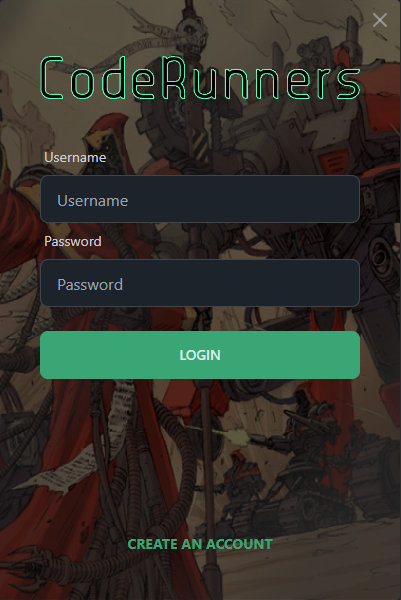
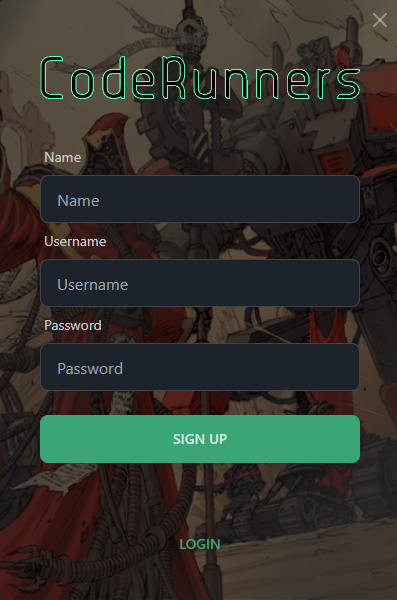
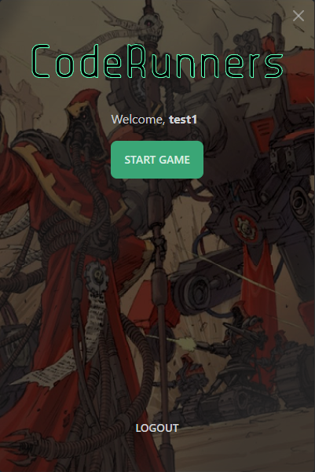

<h1 id="title" align="center">Coderunner Launcher</h1>

<p id="description">a desktop launcher for coderunner</p>

<h2>📷 Screenhots</h2>




<h2>🧐 Features</h2>

- Authentication
- Save File Synchronization

<h2>💻 Built with</h2>

Technologies used in the project:

- React
- Tailwind
- DaisyUI
- Electron

<h2>🛠️ Installation Steps:</h2>

<p>1. Install packages</p>

```
npm install
```

<p>2. Run in dev mode</p>

```
npm run start
```

<p>3. Build</p>

```
npm run make
```
